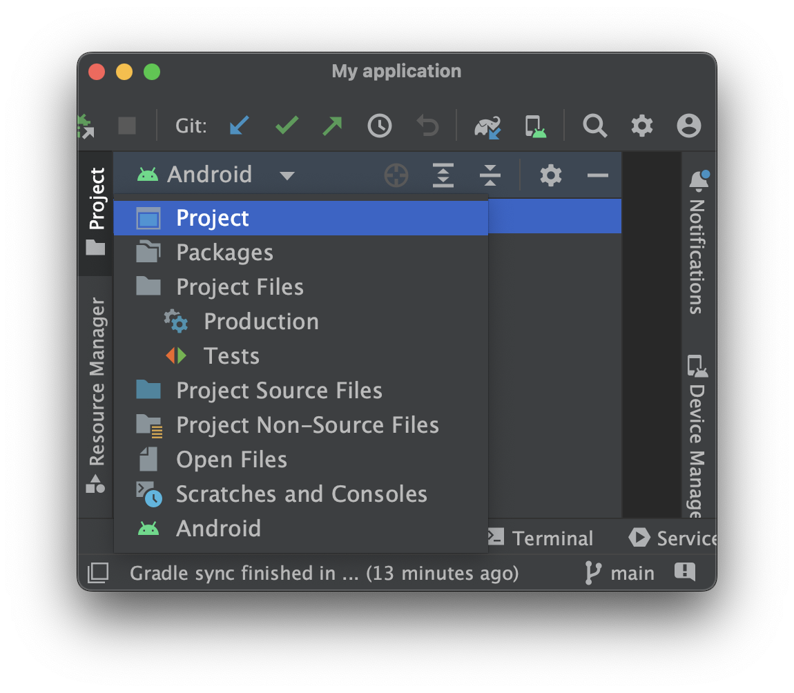
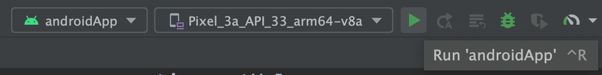
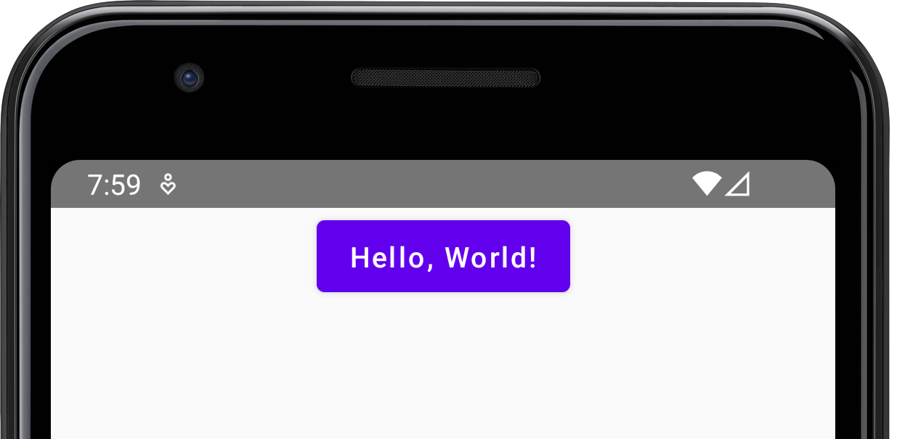
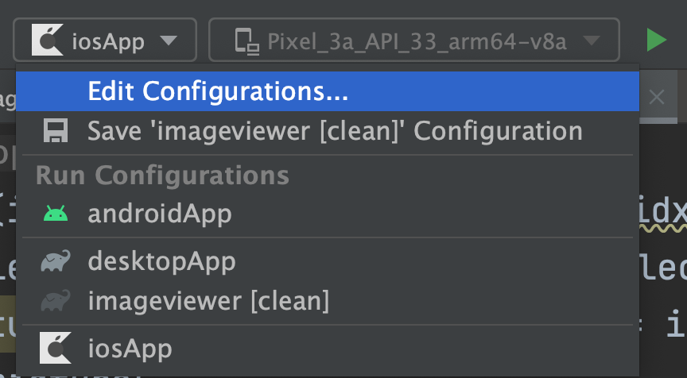
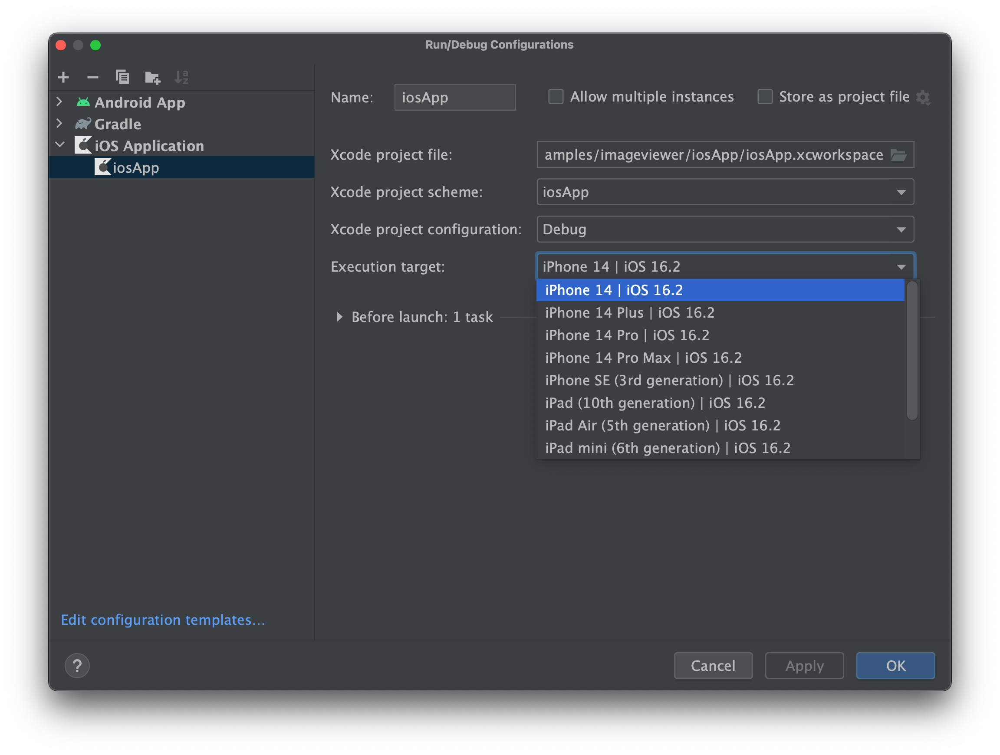
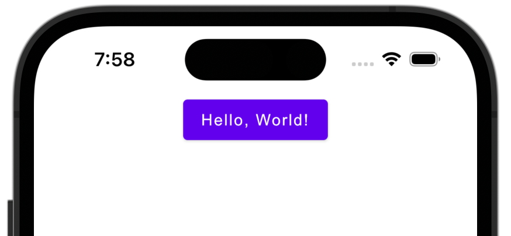
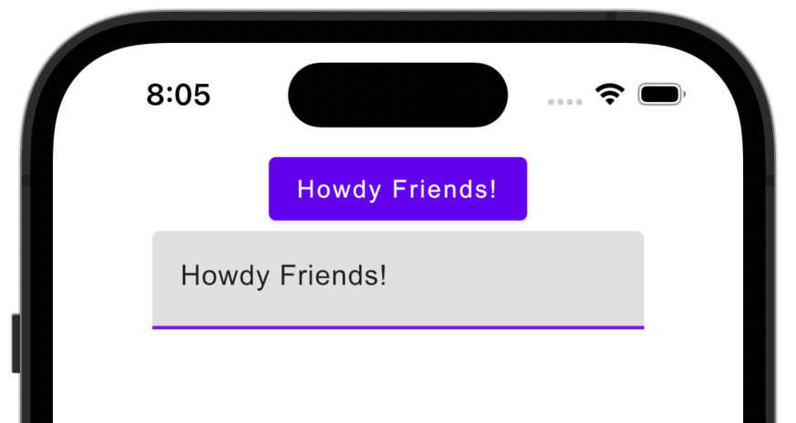

[](https://confluence.jetbrains.com/display/ALL/JetBrains+on+GitHub)
[](https://opensource.org/licenses/Apache-2.0)

# [Compose Multiplatform](https://github.com/JetBrains/compose-multiplatform) Application

Use this template to start developing your own Compose Multiplatform application targeting Desktop,
Android, and iOS (Alpha).


## Setting up your development environment

Your Compose Multiplatform application targeting Desktop, Android and iOS is a Kotlin Multiplatform
project.
Let's make sure you have set up your environment for mobile development with Kotlin Multiplatform.

> **Warning**
> Writing and running iOS-specific code for a simulated or real device requires macOS. This is an
> Apple limitation.

To work with this template, you will need:

- A machine running a recent version of macOS
- [Xcode](https://developer.apple.com/xcode/)
- [Android Studio](https://developer.android.com/studio)
- [Kotlin Multiplatform Mobile plugin](https://plugins.jetbrains.com/plugin/14936-kotlin-multiplatform-mobile)
- [CocoaPods](https://kotlinlang.org/docs/native-cocoapods.html)

### Checking your development environment with `kdoctor`

**Before opening the project in Android Studio**, use [`kdoctor`](https://github.com/Kotlin/kdoctor)
to ensure your development environment is configured correctly. Install `kdoctor`
via [`brew`](https://brew.sh/):

```
brew install kdoctor
```

Then, run `kdoctor` from your terminal. If everything is set up correctly, you should see valid
output. Otherwise, `kdoctor` will provide you which parts of your setup still need configuration:

```
Environment diagnose (to see all details, use -v option):
[✓] Operation System
[✓] Java
[✓] Android Studio
[✓] Xcode
[✓] Cocoapods

Conclusion:
  ✓ Your system is ready for Kotlin Multiplatform Mobile Development!
```

## Opening the project

Use Android Studio to open the project. Make sure you have
the [Kotlin Multiplatform Mobile plugin](https://plugins.jetbrains.com/plugin/14936-kotlin-multiplatform-mobile)
installed.

## Examining the project structure

Switch to the Project View to see all files and targets belonging to the project.



Your Compose Multiplatform project includes three modules:

### `shared`

This Kotlin module that contains the logic common for Desktop, Android and iOS applications – the
code you share between platforms.

**This is also where you will write your Compose Multiplatform code**.

The shared root `@Composable` function for your app lives in `shared/src/commonMain/kotlin/App.kt`.

`shared` uses Gradle as the build system. You can add dependencies and change settings
in `shared/build.gradle.kts`. The shared module builds into a Java library, an Android library and
an iOS framework.

### `desktopApp`

This Kotlin module that builds into a Desktop application. It uses Gradle as the build system. The
desktopApp module depends on and uses the shared module as a regular library.

### `androidApp`

This Kotlin module that builds into an Android application. It uses Gradle as the build system. The
androidApp module depends on and uses the shared module as a regular Android library.

### `iosApp`

This is the Xcode project that builds into an iOS application. It depends on and uses the shared
module as a CocoaPods dependency.

## Running your application

## Desktop

This template contains  `desktopApp` run configuration that you can use to run the desktop target in
Android Studio or IntelliJ IDEA.

Useful Gradle tasks:

- `./gradlew run` - run application
- `./gradlew package` - package native distribution into `build/compose/binaries`

## Android

To run your application on an Android emulator:

- Create
  an [Android virtual device](https://developer.android.com/studio/run/managing-avds#createavd).
- Select the `androidApp` run configuration.
- Select your target device and press **Run**.




<details>
  <summary>Using Gradle</summary>

`./gradlew installDebug` - install Android application on an Android device (on a real device or on
an emulator)

</details>

## iOS

We suggest going through the "Hello, World" steps of creating and deploying a sample project in
Xcode to a simulator and/or your physical device.
A video tutorial for setting up Xcode and running your first "Hello, World" application is available
in [this Standford CS193P lecture recording](https://youtu.be/bqu6BquVi2M?start=716&end=1399).

### Running on an iOS simulator

Once you have configured your environment correctly, you will be able to select which iOS simulator
to run your application in Android Studio on by modifying the `iosApp` run configuration.

Select "Run" | "Edit Configurations..." and navigate to the "iOS Application" | "iosApp" run
configuration. In the "Execution target" drop-down, select your target device.




Press the "Run" button to run your Compose Multiplatform app on the iOS simulator.



### Running on a real iOS device

Running your Compose Multiplatform application on a physical device can be done for free. You need:

- an [Apple ID](https://support.apple.com/en-us/HT204316)
- the registered iOS device in Xcode

Before you continue, make sure that you can successfully run a plain "Hello, World" application from
Xcode on your physical device.

To run the application, set the `TEAM_ID` associated with your Apple ID
in `iosApp/Configuration/Config.xcconfig`.

#### Finding your Team ID

Use `kdoctor --team-ids` to find and set your Team ID. This will list all Team IDs currently
configured on your system, for example:

```
3ABC246XYZ (Max Sample)
ZABCW6SXYZ (SampleTech Inc.)
```

<details>
<summary>Alternative way of finding your Team ID</summary>

If you're running into trouble with the method described above, you can try this alternative method.

- Run the `iosApp` run configuration from Android Studio (it will fail)
- Open the `iosApp/iosApp.xcworkspace` in Xcode
- Select `iosApp` in the menu on the left side
- Navigate to "Signing & Capabilities"
- Select your Personal Team in the "Team" dropdown. If you haven't set up your team, use the "Add
  account..." option and follow the steps inside Xcode.

</details>

Set this Team ID in `iosApp/Configuration/Config.xcconfig` in the `TEAM_ID` field.

After that you can re-open the project in Android Studio, and it will show the registered iOS device
in the `iosApp`
run configuration.

### Make your first changes

The common entry point for your Compose Multiplatform app is located
in  `shared/src/commonMain/kotlin/App.kt`. Here, you will see the code that is responsible for
rendering the "Hello, World" button and the animated Compose Multplatform logo. If you make changes
here, you will see them reflected on both Android and iOS:

```kotlin
@OptIn(ExperimentalResourceApi::class)
@Composable
internal fun App() {
    MaterialTheme {
        var greetingText by remember { mutableStateOf("Hello, World!") }
        var showImage by remember { mutableStateOf(false) }
        Column(Modifier.fillMaxWidth(), horizontalAlignment = Alignment.CenterHorizontally) {
            Button(onClick = {
                greetingText = "Hello, ${getPlatformName()}"
                showImage = !showImage
            }) {
                Text(greetingText)
            }
            AnimatedVisibility(showImage) {
                Image(
                    painterResource("compose-multiplatform.xml"),
                    null
                )
            }
        }
    }
}
```

Update the shared code by adding a text field that will update the name displayed on the button:

```diff
@OptIn(ExperimentalResourceApi::class)
@Composable
internal fun App() {
    MaterialTheme {
        var greetingText by remember { mutableStateOf("Hello, World!") }
        var showImage by remember { mutableStateOf(false) }
        Column(Modifier.fillMaxWidth(), horizontalAlignment = Alignment.CenterHorizontally) {
            Button(onClick = {
                greetingText = "Hello, ${getPlatformName()}"
                showImage = !showImage
            }) {
                Text(greetingText)
            }
+           TextField(greetingText, onValueChange = { greetingText = it })
            AnimatedVisibility(showImage) {
                Image(
                    painterResource("compose-multiplatform.xml"),
                    null
                )
            }
        }
    }
}
```



### Configuring the iOS application

This template contains a `iosApp/Configuration/Config.xcconfig` configuration file that allows you
to configure most basic properties without having to move to Xcode. It contains:

- `APP_NAME` - target executable and application bundle name
- `BUNDLE_ID` - [bundle identifier](https://developer.apple.com/documentation/bundleresources/information_property_list/cfbundleidentifier#discussion)
- `TEAM_ID` - [Team ID](https://developer.apple.com/help/account/manage-your-team/locate-your-team-id/#:~:text=A%20Team%20ID%20is%20a,developer%20in%20App%20Store%20Connect.)

Note: To configure the `APP_NAME` setting, open `Config.xcconfig` in any text editor *before
opening* the project in Android Studio, and set the desired name.

If you need to change this setting after you open the project in Android Studio, please do the
following:

- close the project in Android Studio
- run `./cleanup.sh` in your terminal
- change the setting
- open the project in Android Studio again

For configuring advanced settings, you can use Xcode. Open the `iosApp/iosApp.xcworkspace` in Xcode
after opening the project in Android Studio, and use Xcode to make your changes.
