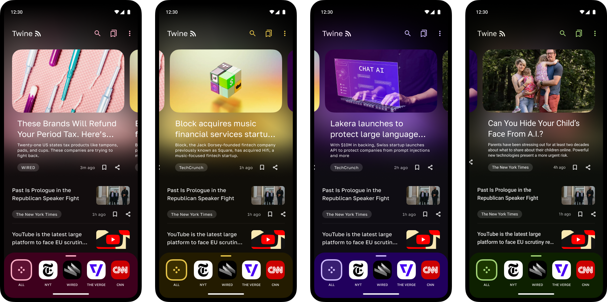

# Twine - RSS Reader

Twine is a modern cross-platform RSS reader app built using Kotlin and Compose Multiplatform. It features a nice user experience
to browse through your feeds, with [dynamic theming](https://m3.material.io/styles/color/dynamic-color/user-generated-color), changing app ambient color based on content.

## Download

## Features ✨

- Supports **RDF**, **RSS**, **Atom** and **JSON** feeds
- Feed management: Add, edit, delete, pin and group feeds
- Bottom bar in home screen to access pinned feeds and groups
- Smart fetching: Twine looks for feeds when given any website homepage
- Article shortcut to fetch full article in the reader view
- Bookmark posts to read later
- Search posts
- Blocked words: Filter out content based on keywords
- Background sync
- Cloud sync support with Dropbox (Alpha ⚠)
- Import and exports your feeds with OPML
- Light, dark and amoled theme support

## Project Structure 🏗️

The project follows a modular Kotlin Multiplatform structure:

- `androidApp`: Android-specific application code and entry point.
- `iosApp`: iOS-specific application code (Swift/Xcode project).
- `shared`: Contains the core UI logic using Compose Multiplatform, ViewModels (using `kotlin-inject`), and shared presentation logic.
- `core/`: Modularized business logic.
    - `base`: Base utilities, common interfaces, and platform abstractions.
    - `data`: Data layer containing repositories, local database (SQLDelight), and sync logic.
    - `model`: Domain models used across the project.
    - `network`: Network layer using Ktor for fetching feeds and parsing.
- `resources/icons`: Shared icon resources.

## Tech Stack 📚

- [Kotlin Multiplatform](https://kotlinlang.org/lp/multiplatform/)
- [Compose Multiplatform](https://www.jetbrains.com/lp/compose-multiplatform/)
- [Kotlin Coroutines](https://github.com/Kotlin/kotlinx.coroutines)
- [Ktor](https://ktor.io/)
- [SQLDelight](https://cashapp.github.io/sqldelight/2.0.0-alpha05/)
- [Kotlin-inject](https://github.com/evant/kotlin-inject)
- [Coil](https://coil-kt.github.io/coil/)
- [Multiplatform Markdown Renderer](https://github.com/mikepenz/multiplatform-markdown-renderer)
- [Jetpack Libraries](https://developer.android.com/kotlin/multiplatform)

For full list of dependencies used, please take a look at the [catalog](/gradle/libs.versions.toml) file.

## Development 🛠️

You can just clone the repo and build it locally without requiring any changes. 

Project requires JDK 21+, and based on the AGP version defined in [`libs.versions.toml`](/gradle/libs.versions.toml) file, 
you can use appropriate Android Studio to import the project.

## Contributing 🛠️

You can contribute bug fixes to the project via PRs, for anything else open an issue to start a conversation.

This project uses ktfmt, provided via the spotless gradle plugin, and the bundled project IntelliJ codestyle. Run
`./gradlew spotlessApply` to format the code before raising a PR.

### Translations

You can help translate project on [Crowdin](https://crowdin.com/project/twine-rss-reader). We use Compose resources
for strings, you can read more about it [here](https://www.jetbrains.com/help/kotlin-multiplatform-dev/compose-multiplatform-resources-usage.html#strings).

## Made with 💖 by

- [Sasikanth Miriyampalli](https://www.sasikanth.dev) / Development
- [Eduardo Pratti](https://twitter.com/edpratti) / Design

## Error Reporting by

## License

