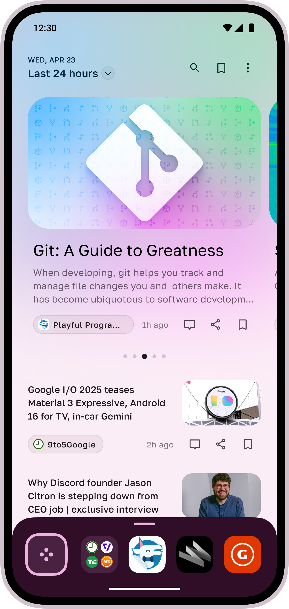
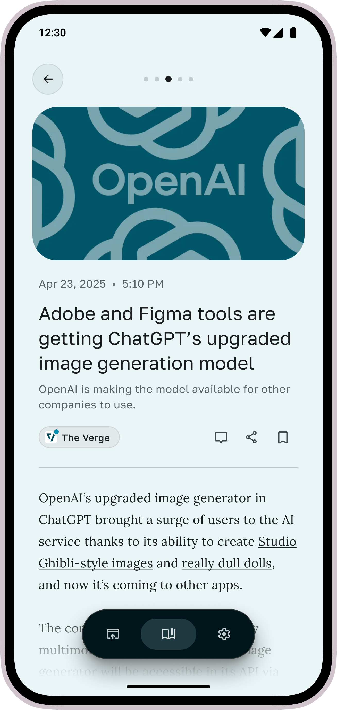
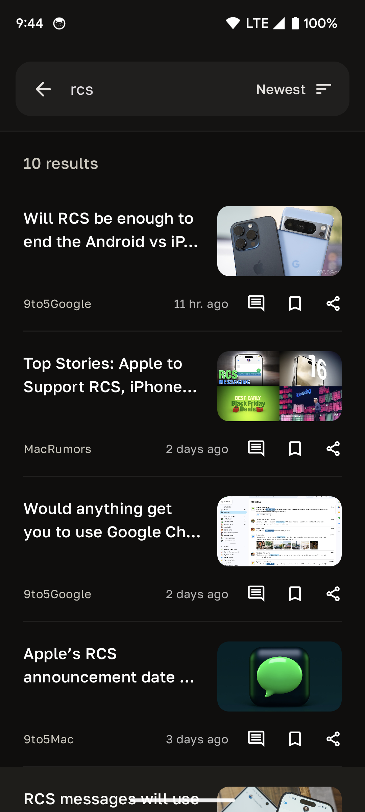
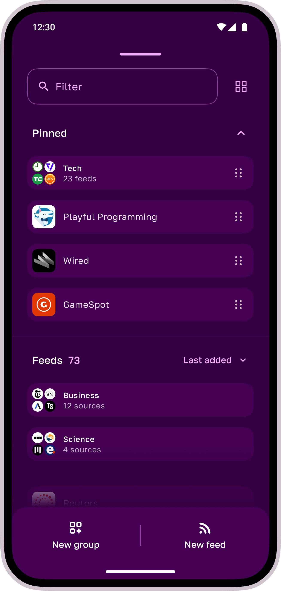

# Twine - RSS Reader

Twine is a cross-platform RSS reader app built using Kotlin and Compose Multiplatform. It features an nice
user interface and experience to browse through the feeds, and supports Material 3 content based 
[dynamic theming](https://m3.material.io/styles/color/dynamic-color/user-generated-color).

## Download

## Images

  
  
  
  

## Features ✨

- Supports **RDF**, **RSS**, **Atom** and **JSON** feeds
- Feed management: Add, Edit, Remove & Pin feeds
- Feed grouping
- Access to pinned feeds/groups from bottom bar in the home screen
- Smart fetching: Twine looks for feeds when given any website homepage
- Article shortcut to fetch full article in reader view
- Bookmark posts to read later
- Search posts
- Background sync
- Import and exports your feeds with OPML
- Dynamic content theming
- Light/Dark mode support

## Tech Stack 📚

- [Kotlin Multiplatform](https://kotlinlang.org/lp/multiplatform/)
- [Kotlin Coroutines](https://github.com/Kotlin/kotlinx.coroutines)
- [Compose Multiplatform](https://www.jetbrains.com/lp/compose-multiplatform/)
- [Ktor](https://ktor.io/)
- [SQLDelight](https://cashapp.github.io/sqldelight/2.0.0-alpha05/)
- [Decompose](https://arkivanov.github.io/Decompose/)
- [Kotlin-inject](https://github.com/evant/kotlin-inject)

For full list of dependencies used, please take a look at the [catalog](/gradle/libs.versions.toml) file.

## Development 🛠️

You can just clone the repo and build it locally without requiring any changes. 

Project requires JDK 20+, and based on the AGP version defined in [`libs.versions.toml`](/gradle/libs.versions.toml) file, 
you can use appropriate Android Studio to import the project.

## Contributing 🛠️

You can contribute bug fixes to the project via PRs, for anything else open an issue to start a conversation.

This project uses ktfmt, provided via the spotless gradle plugin, and the bundled project IntelliJ codestyle. Run
`./gradlew spotlessApply` to format the code before raising a PR.

### Translations

You can help translate project on [Crowdin](https://crowdin.com/project/twine-rss-reader). We use Compose resources
for strings, you can read more about it [here](https://www.jetbrains.com/help/kotlin-multiplatform-dev/compose-multiplatform-resources-usage.html#strings).

## Made with 💖 by

- [Sasikanth Miriyampalli](https://www.sasikanth.dev) / Development
- [Eduardo Pratti](https://twitter.com/edpratti) / Design

## Error Reporting by

## License

