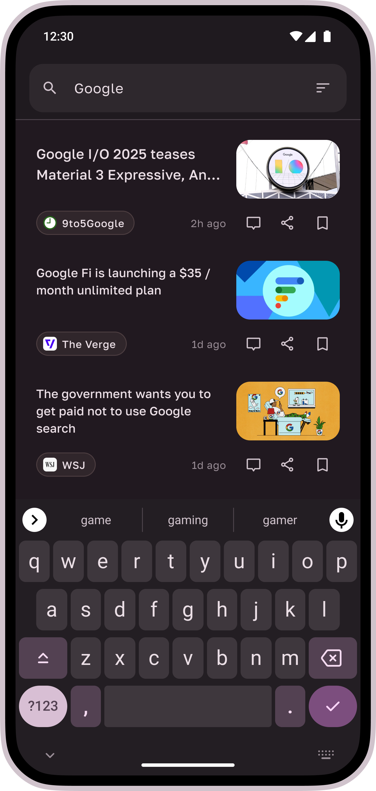

# Twine - RSS Reader


[](https://github.com/sponsors/msasikanth)


Twine is a multiplatform RSS reader app built using Kotlin and Compose Multiplatform. It features an nice
user interface and experience to browse through the feeds, and supports Material 3 content based 
[dynamic theming](https://m3.material.io/styles/color/dynamic-color/user-generated-color).

## Download

<a href='https://play.google.com/store/apps/details?id=dev.sasikanth.rss.reader&pcampaignid=pcampaignidMKT-Other-global-all-co-prtnr-py-PartBadge-Mar2515-1'></a>
<a href="https://apps.apple.com/us/app/twine-rss-reader/id6465694958?itsct=apps_box_badge&amp;itscg=30200" style="display: inline-block; overflow: hidden; border-radius: 13px;"></a>

## Screenshots

<p style="text-align: center;">
  
  
  
  
  
  
  
  
  
</p>

## Features ✨

- Supports RSS & Atom feeds
- Gorgeous home feed
- Pin frequently visited feeds
- Smart fetching: Twine looks for feeds when given any website homepage
- Reading view with shortcut to fetch full article
- Bookmark posts to read later
- Search posts
- Background sync
- Feed management: Add, Edit & Pin feeds
- Import and exports your feeds with OPML 

## Tech Stack 📚

- [Kotlin Multiplatform](https://kotlinlang.org/lp/multiplatform/)
- [Kotlin Coroutines](https://github.com/Kotlin/kotlinx.coroutines)
- [Compose Multiplatform](https://www.jetbrains.com/lp/compose-multiplatform/)
- [Ktor](https://ktor.io/)
- [SQLDelight](https://cashapp.github.io/sqldelight/2.0.0-alpha05/)
- [Decompose](https://arkivanov.github.io/Decompose/)
- [Kotlin-inject](https://github.com/evant/kotlin-inject)

For full list of dependencies used, please take a look at the [catalog](/gradle/libs.versions.toml) file.

## Development 🛠️

You can just clone the repo and build it locally without requiring any changes. 

Project requires JDK 20+, and based on the AGP version defined in [`libs.versions.toml`](/gradle/libs.versions.toml) file, 
you can use appropriate Android Studio to import the project.

## Contributing 🛠️

You can contribute bug fixes to the project via PRs, for anything else open an issue to start a conversation.

This project uses ktfmt, provided via the spotless gradle plugin, and the bundled project IntelliJ codestyle. Run
`./gradlew spotlessApply` to format the code before raising a PR.

## Made by ❤️

- [Sasikanth Miriyampalli](https://www.sasikanth.dev) / Development
- [Eduardo Pratti](https://twitter.com/edpratti) / Design

## Error Reporting by

<a href="http://www.bugsnag.com/">
  
</a>

## License

```
Copyright Sasikanth Miriyampalli

Licensed under the Apache License, Version 2.0 (the "License");
you may not use this file except in compliance with the License.
You may obtain a copy of the License at

    https://www.apache.org/licenses/LICENSE-2.0

Unless required by applicable law or agreed to in writing, software
distributed under the License is distributed on an "AS IS" BASIS,
WITHOUT WARRANTIES OR CONDITIONS OF ANY KIND, either express or implied.
See the License for the specific language governing permissions and
limitations under the License.
```
